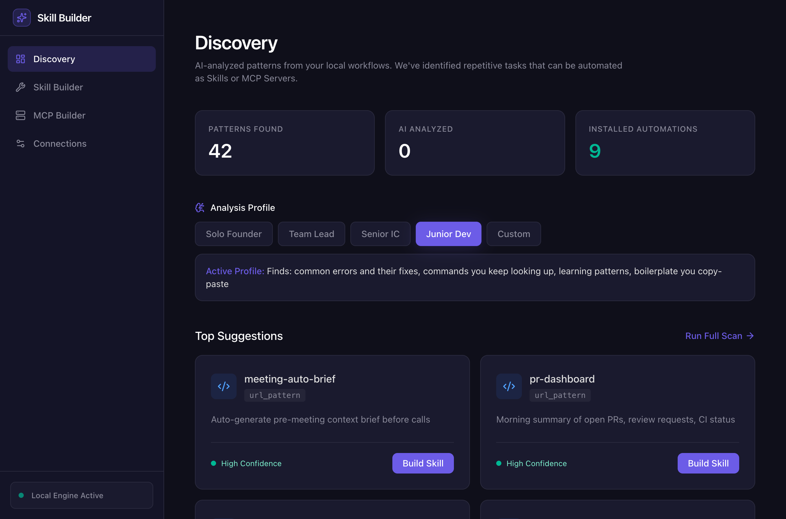
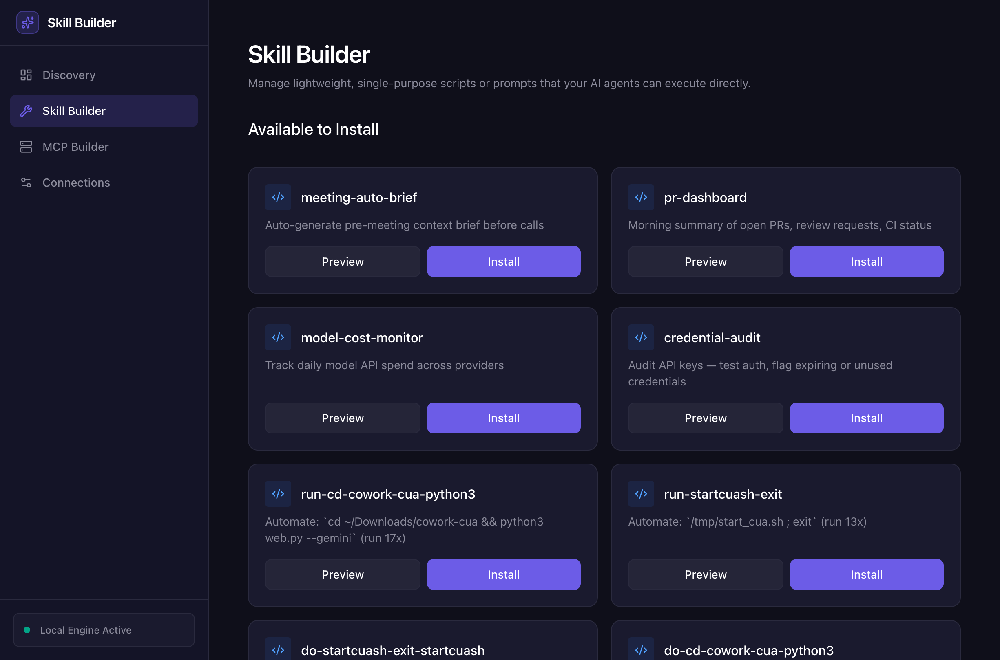
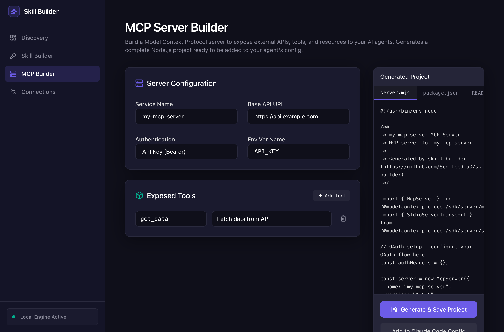
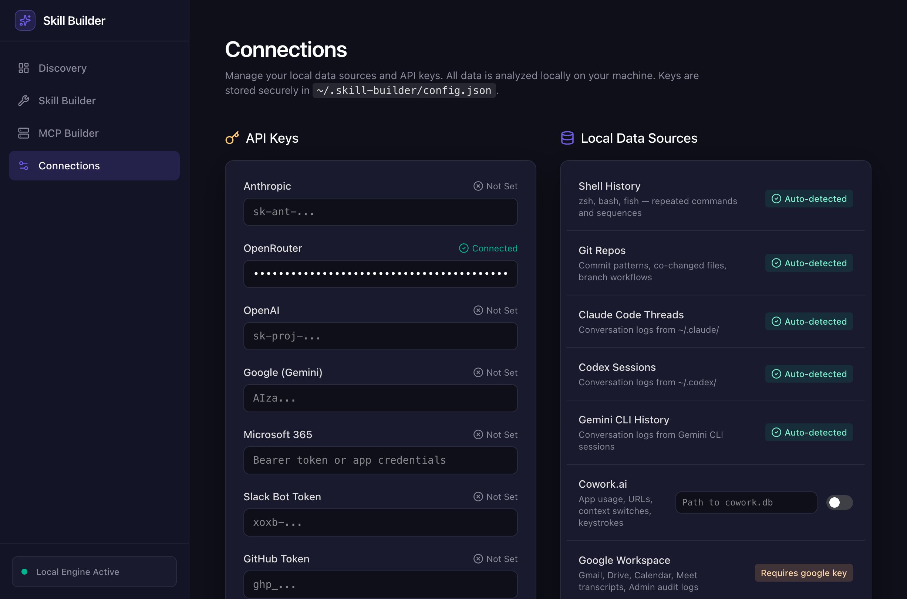

# skill-builder

Reads your shell history, git commits, browser history, and Claude Code conversation logs. Finds patterns you repeat. Generates working skills (slash commands) you can install in Claude Code, Codex, Cursor, or any agent that reads markdown.

Has 15 built-in skills. If you add an API key, it uses an LLM to generate skills for any pattern it finds — not just the built-in ones.

Built this in a day for our own use. If you find it useful, make it better.

## Screenshots

**Discovery** — patterns found across your data sources, ranked by confidence:



**Skill Builder** — preview and install skills with one click:



**MCP Builder** — generate complete MCP server projects from a form:



**Connections** — plug in API keys and data sources:



## Quick Start

```bash
git clone https://github.com/Scottpedia0/skill-builder.git
cd skill-builder
npm install

# See what it finds on your machine (reads shell history + git automatically)
node bin/cli.mjs suggest

# Preview a skill before installing
node bin/cli.mjs implement pr-dashboard --dry-run

# Install it
node bin/cli.mjs implement pr-dashboard
# → writes to ~/.claude/commands/pr-dashboard.md
```

If you don't have shell history or want to test with sample data:

```bash
node scripts/generate-demo-db.mjs
node bin/cli.mjs suggest --days 7
```

## What It Does

Reads data from your machine → finds things you do repeatedly → suggests skills to automate them.

```
  Shell history ──┐
  Git commits ────┤
  Browser URLs ───┤──→ Analyzer ──→ Suggester ──→ Generator ──→ skill.md
  Claude threads ─┤
  Telemetry ──────┘
```

**Without an API key:** 15 built-in skills install instantly (marked ✅).

**With an API key:** The LLM generates a custom skill for any pattern (marked 🤖). Tested with OpenRouter, Anthropic, Google, OpenAI.

## Commands

```
skill-builder suggest           # see all suggestions
skill-builder daily             # one per day, no repeats
skill-builder implement <id>    # build and install a skill
skill-builder list              # show built-in skills
skill-builder --help            # all options
```

`--dry-run` previews without installing. `--days N` controls the analysis window.

## Built-in Skills

| Skill | What it does |
|-------|-------------|
| pr-dashboard | PR/CI summary across your GitHub repos |
| meeting-auto-brief | Pre-meeting context from calendar + git + GitHub |
| model-cost-monitor | API spend check (OpenRouter, Anthropic) |
| credential-audit | Test your API keys, flag broken ones |
| slack-integration-health | Check Slack bot auth and rate limits |
| tab-audit | Find stale browser tabs from Chrome/Arc history |
| video-cataloger | Index local recordings by date and size |
| gmail-templates | Email templates for follow-ups, intros, updates |
| git-cleanup | Delete merged branches, prune remote refs |
| dep-update | Check outdated packages, security audit |
| port-killer | Kill processes on dev ports (EADDRINUSE fix) |
| docker-reset | Stop all containers, prune, reclaim disk |
| env-check | Compare .env.example vs .env, find missing vars |
| log-search | Search log files for recent errors |
| db-snapshot | Backup SQLite/PostgreSQL before migrations |

## Data Sources

These work automatically — no setup:

- **Shell history** — zsh, bash, fish. Finds repeated commands and sequences.
- **Git history** — commit patterns, files that change together.
- **Browser history** — Chrome, Arc, Brave, Edge. Frequent URLs and repeated searches.
- **Claude Code threads** — reads `~/.claude/` conversation logs. Finds prompts you repeat.

Optional:

- **Cowork.ai telemetry** — app usage, context switches, keystrokes. Set `telemetryDb` in config.

## LLM Generation

Add an API key to `~/.skill-builder/config.json` and the tool generates skills for any pattern, not just the 15 built-in ones:

```json
{
  "keys": { "openrouter": "sk-or-..." },
  "analysisModel": "openrouter-auto"
}
```

Supports: OpenRouter, Anthropic, Google (Gemini), OpenAI. The generated skills have real error handling, not templates.

## Web UI

```bash
node ui/server.mjs    # start API on :3456
cd ui && npm install && npm run dev  # start React UI on :3000
```

Four views: Discovery (suggestions), Skill Builder (install/manage), MCP Builder (generate MCP servers), Connections (API keys + data sources).

## Adding Skills

Add a function to `lib/generator.mjs`:

```javascript
const IMPLEMENTATIONS = {
  "your-skill": (s, config) => `---
name: your-skill
description: "When to use this"
---

# Your Skill

\`\`\`bash
echo "real commands here"
\`\`\`
`,
};
```

Or just add an API key and the LLM handles it.

## Contributing

PRs welcome. Add a data source analyzer, add a built-in skill, fix a bug, improve a prompt. The code is straightforward — each analyzer is a standalone file in `lib/`, each skill is a function in `lib/generator.mjs`.

## License

MIT
